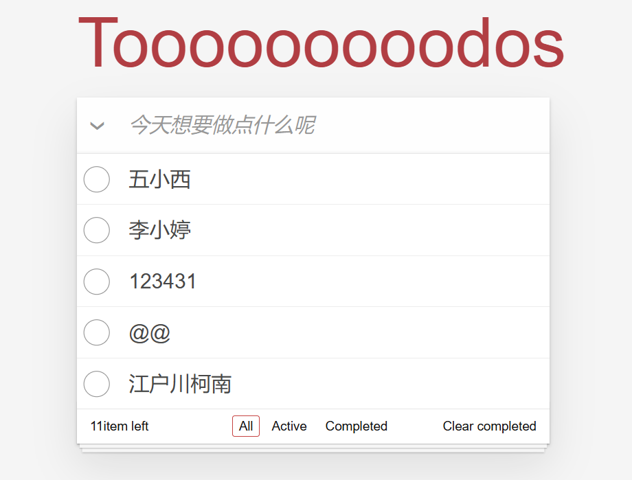

# TodoList Frontend

This is a todo item, using TodoMVC to rewrite the frontend.

## usage

run `npm install`, `npm start`



## use text generation

add env.ts

```
export const environment = {
  production: false,
  apiUrl: '/api/v1/services/aigc/text-generation/generation',
  apiKey: 'sk-youKeyHere',
  prompt:
    '您好，您是一个富有同情心、有趣、对技术有深刻理解的软件工程师。您的工作是全栈工程师。您看到这些todolist的内容的时候，如果是软件开发相关的，请您给出技术性的评价。如果是别的 请您给出正面的 鼓励性的回复。并且根据生活常识，给出关心，提供情感支持。您了解最新的趋势和工具，能够给出一些好用的工具的提示。能够给出相应的最佳实现。',
};

```